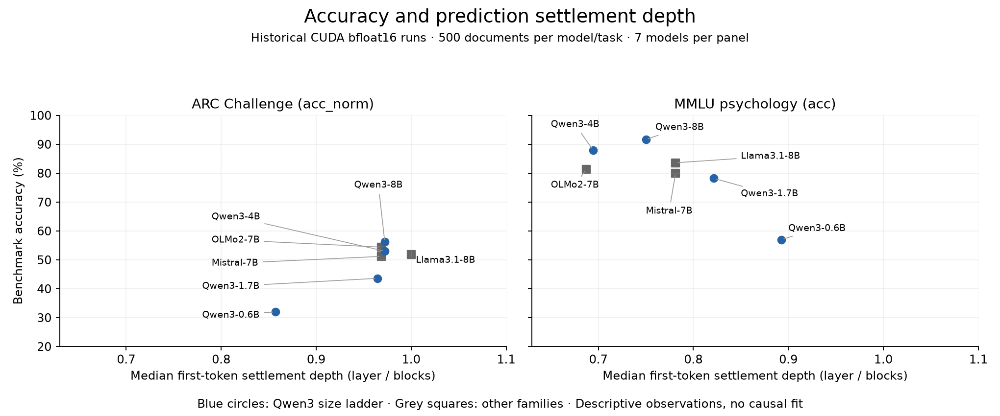

# What benchmark scores do not tell you

## Higher accuracy does not consistently mean earlier prediction settlement

Evalmetry's saved layer signals let us ask a question that a benchmark score
alone cannot answer: **when does a layer's vocabulary prediction settle on the
final layer's prediction?** In this historical seven-model study, higher accuracy
was associated with later settlement on ARC Challenge, but earlier settlement on
MMLU high school psychology. The relationship depends on the task and the scored
position; prediction depth is not a universal model-quality score.

These are exploratory results from September 10, 2026, using lm-eval 0.4.9.1,
CUDA bfloat16, requested batch 16, zero-shot direct prompting and 500 documents
per model/task. They demonstrate analysis of saved data, **not a new 1.1.0 GPU
verification run**. The current release's independent evidence that recording
preserves scores is in the [verification report](verification.md).

## Definition: settlement is not correctness

For each scored token position, project each residual state through the model's
final normalization and vocabulary head (the logit lens). Find the earliest
layer k whose top-1 token agrees with the final layer at every layer k through L.
Settlement depth is k/L, including embedding depth 0 and final depth 1. It says
when the model's final token prediction became stable, not when it found the
correct answer or finished reasoning.

The analysis selects the gold answer choice's trajectory and reports the median
at **step 0**, the position predicting its first continuation token. A model can
settle on a wrong token. Benchmark correctness still comes from lm-eval's choice
scoring, not from the logit lens. ARC's full answer continuations average roughly
6–7 tokens here; MMLU's answer-letter continuations have one token. Comparing all
ARC positions with one-token MMLU would mix answer selection with prediction
inside an already supplied continuation.



Read each panel as seven model-level observations, with the same axes. ARC
Challenge uses length-normalized accuracy; MMLU uses accuracy. The Qwen3 size
ladder is marked with circles; other families use squares. No fitted line or
confidence interval is shown: these seven selected models are not an independent
random sample, and task format, architecture, size and vocabulary differ.

| Qwen3 model | ARC accuracy | ARC settlement depth | MMLU accuracy | MMLU settlement depth |
| --- | ---: | ---: | ---: | ---: |
| 0.6B | 32.0% | 0.8571 | 57.0% | 0.8929 |
| 1.7B | 43.6% | 0.9643 | 78.2% | 0.8214 |
| 4B | 53.0% | 0.9722 | 88.0% | 0.6944 |
| 8B | 56.2% | 0.9722 | 91.6% | 0.7500 |

Across all seven models, Pearson r between accuracy and first-token median
settlement depth is **+0.878 for ARC** and **−0.798 for MMLU**. Restricting to the
four Qwen3 models preserves the signs (+0.900 and −0.909). This is a descriptive
sensitivity check, not causal evidence that depth improves or harms accuracy.
The non-monotonic MMLU depth between Qwen3-4B and 8B is visible in the table.
Sources: [summary](evidence/prediction_summary.tsv),
[correlations](evidence/depth_correlations.tsv), and
[historical scoring conditions and model revisions](evidence/historical_scores.tsv).

## Reuse the saved observations without another model run

The [prediction-depth parquet](evidence/prediction_depth.parquet) contains 25,821
unaffected per-position settlement rows, with task, document, choice, step, model,
correctness, settled layer and relative depth. These are positions, not 25,821
independent documents. Restrict to step 0 and group by model/task to recover the
medians above; split by correctness to ask whether wrong predictions settle
similarly. Retaining these keys is what makes post-evaluation questions possible.

```python
import pandas as pd

rows = pd.read_parquet("docs/evidence/prediction_depth.parquet")
first = rows[rows["step"] == 0]
print(first.groupby(["task", "model"])["depth"].median())
print(first.groupby(["task", "model", "is_correct"])["depth"].median())
```

For a new run, `evalmetry.storage.load_signals(run_path, "signals")` reads the
saved observations and joins their document labels. Select `is_target_choice`
and `step == 0`, then use `evalmetry.report.prediction_depth(signals, n_blocks)`.
The CLI's `report` command provides grouping and comparison views; benchmark
scores remain those supplied by lm-eval.

## Evidence boundaries and a corrected analysis error

The original seven-model per-layer dumps are not available in this workspace.
The retained derived rows reproduce settlement medians and the published
correlations, but cannot reconstruct every layer trajectory. The historical TSV
preserves model revisions and the conditions above; the full original software,
seed, dataset-revision and collection-command manifest is incomplete. These
results should guide a new controlled study, not serve as an exact replay claim.

During report preparation, the internal analysis helper's gold top-10 arrival
metric was found to accept zero-based rank 10 (eleventh place without ties).
Its threshold was corrected from `rank > top_k` to `rank >= top_k`, with four
boundary regression cases. Historical top-10 statistics were **not** silently
relabelled or claimed to be recomputed: the original trajectories are required.
This showcase excludes those statistics and their old plots. Settlement uses a
separate token-equality calculation and is unaffected. The
[correction record](evidence/gold_arrival_correction_20260920.json) records scope.

A useful next experiment would hold the model, prompts, document selection and
actual batch fixed while varying answer format, then compare first-token depth
with uncertainty estimated at the document level. Whether the observed task
contrast survives that control remains open. Start with default signals:
optional axes/extremes collection can be expensive, as the
[measured cost](verification.md#collection-accuracy-cost-and-limits) shows.
